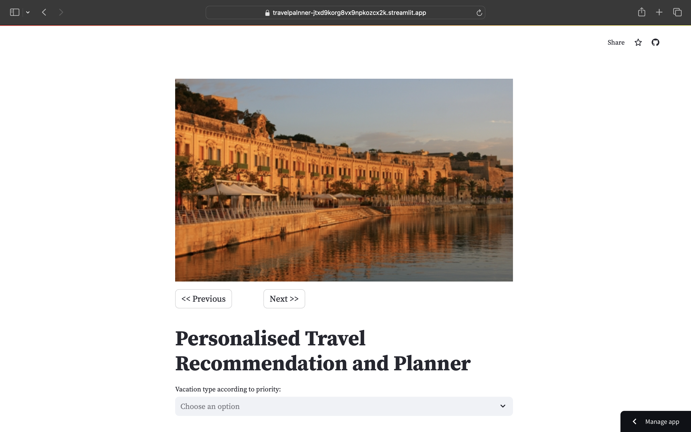
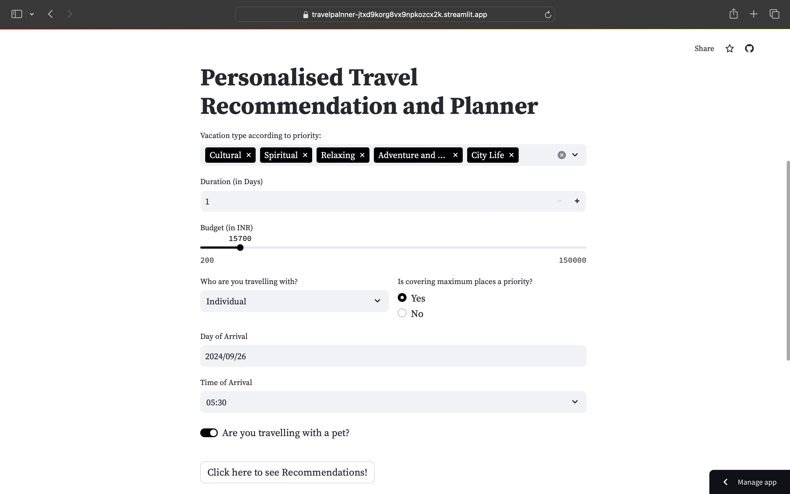
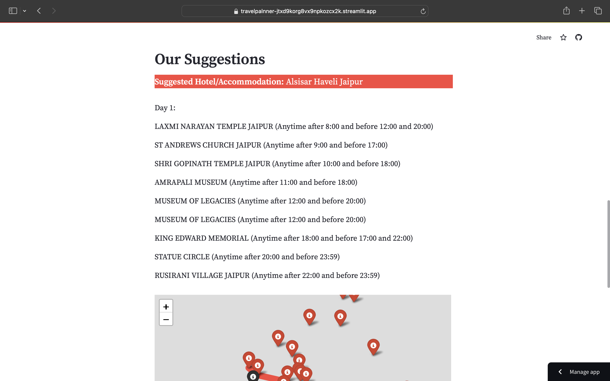
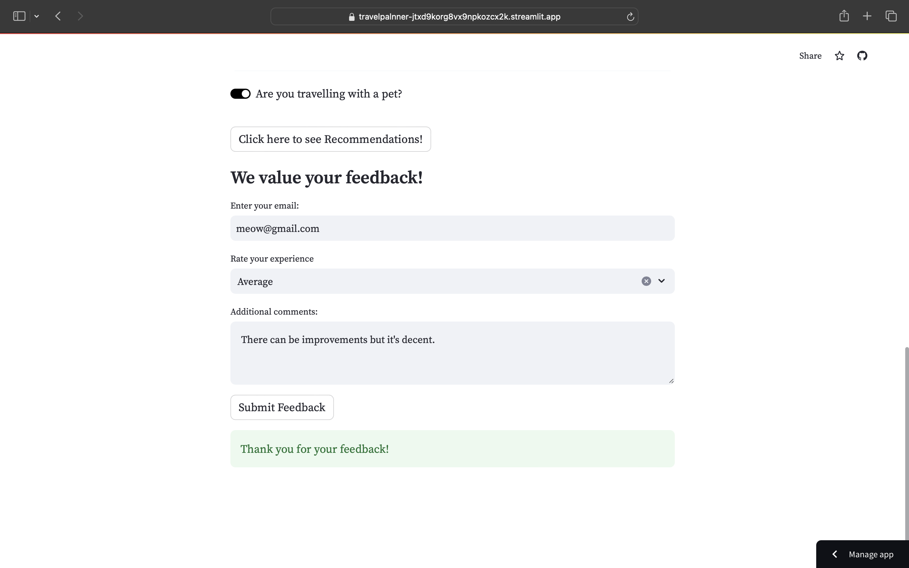

## Aim

While recommendation systems have become widespread in e-commerce and entertainment, their potential impact on the travel and tourism industry is just beginning to unfold. Travel planning is inherently complex, involving multiple decisions related to destinations, accommodations, activities, and transportation. Recommendation systems can simplify this process by providing tailored suggestions for every aspect of a trip, helping travelers make informed decisions that align with their preferences, budget, and time constraints.

Let us design an application that focuses on the convenience of tourists by leveraging recommendation systems can create a personalized, intuitive experience for travelers.

## How to run it locally

To run the project locally, ensure that you have cloned the repository and installed all the libraries from the requirements.txt file. You may create a virtual environment using pip or conda to make the process a bit more streamlined. 

Then, you can go ahead and run the main.py (from the root directory of the project) file using streamlit like so:
```
source myenv/bin/activate
pip install -r requirements.txt
streamlit run main.py
```
## How to access currently deployed version

Use this link to access the webpage - "https://travelpalnner-jtxd9korg8vx9npkozcx2k.streamlit.app"

## Pictures : 







